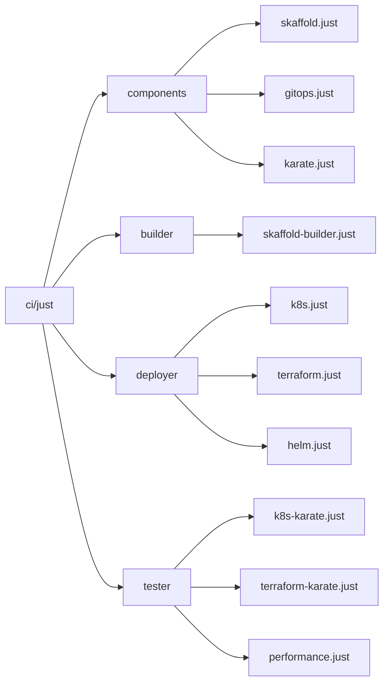
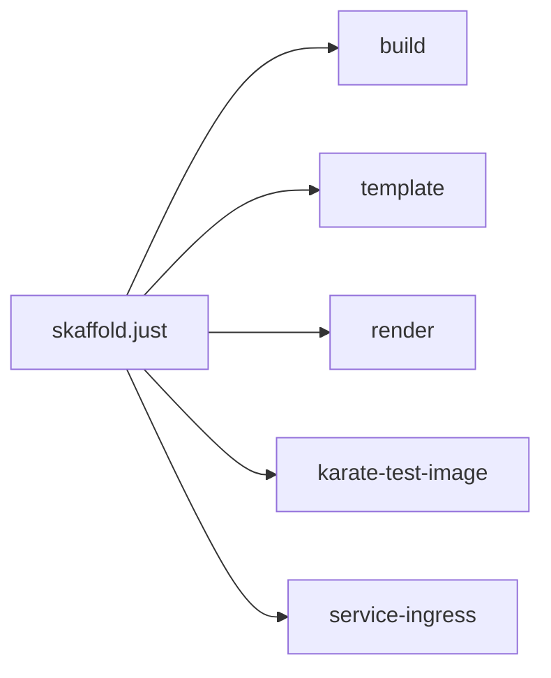
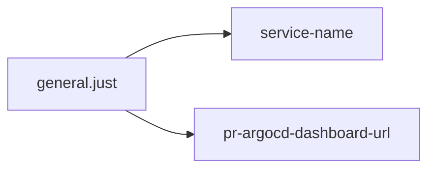
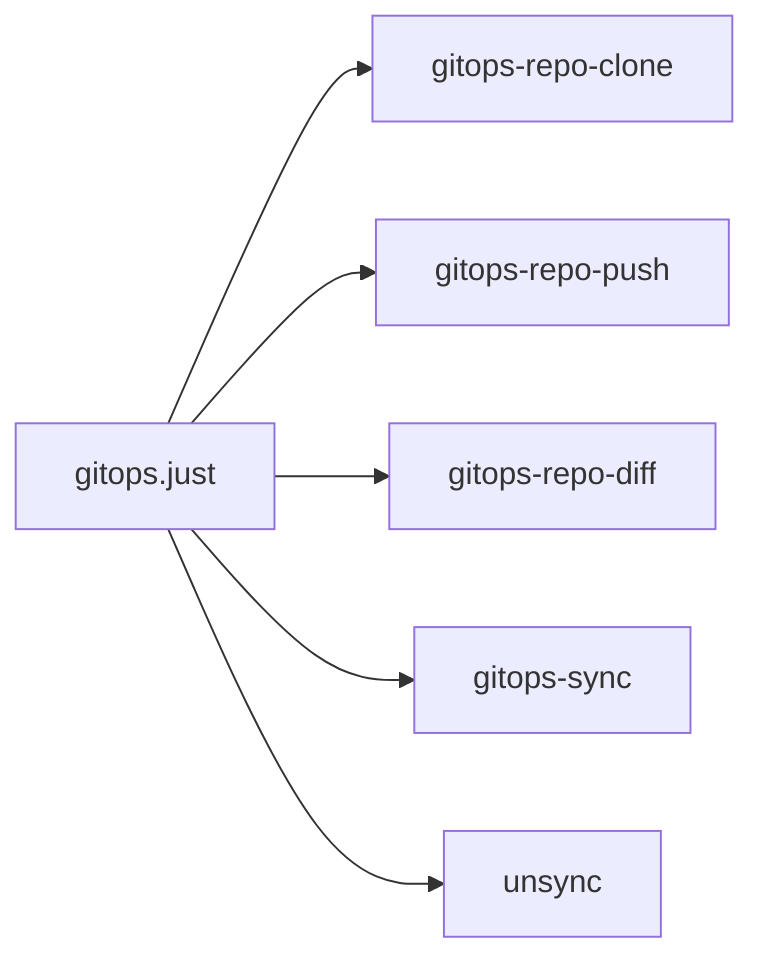
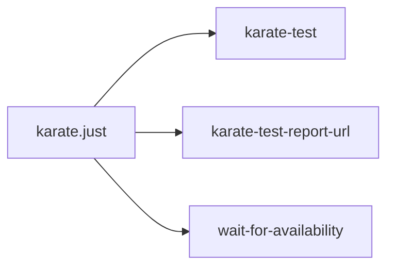

# Just Targets

## K8S (restructure/ci/justfile) Targets

1. `template ENV REGION DIGEST_SOURCE='remote'`

  - Run `Skaffold render` for specific environment and region.
---
2. `build`
  
  - `Build and Push` images to registry.
---
3. `service-namespace`

  - Return `service` k8s namespace
  - Can be computed from `PWD`
  - Can be read from `ENV` variable
---
4. `service-name` 
  
  - Return `service` name
  - Can be computed from `PWD`
  - Can be read from `ENV` variable
---
5. `render ENV REGION DIGEST_SOURCE="remote"`
  
  - Dependencies
    - Direct: `1. template` target
  - Create `Manifest` directory and move generated manifests to it
  - Variables
    - `SERVICE_PATH` (`namespace`/`service`)
---
6. `gitops-repo-clone`

  - Clone `gitops` repo
  - Variables
    - `GITOPS_DIR`
    - `GITOPS_REPO_USER`
    - `GITOPS_REPO`
    - `GITOPS_FLAGS`
---
7. `service-ingress ENV REGION DIGEST_SOURCE="none"`
  
  - Dependencies
    - Direct: `5. render`
  - Return `service ingress` URLs 
---
8. `gitops-repo-push ENV MESSAGE`

  - Variables
    - `SERVICE_NAME`
  - Commit and Push to `gitops` repo
---
9. `gitops-repo-diff`
  
  - Run `git diff` on `gitops` repo
---
10. `gitops-sync ENV REGION`
  
  - Dependencies
    - Direct: `5. render`
  - Variables
    - `SERVICE_PATH`
  - Copy `Manifest` directory to `gitops` repo
---
11. `unsync ENV REGION MODE="file"`

  - Variables
    - `SERVICE_PATH`
  - Remove `Manifest file/dir` from `gitops` repo
---
12. `wait-for-availability URL ATTEMPTS="96" WAIT="5"`

  - Wait for `URL` to be available
  - `HTTP_URL=${URL}/healthcheck`
  - `GRAPHQL_URL=${URL}/graphql`
---
13. `service-deployable ENV REGION`
  
  - Check if `service` is deployable
---
14. `pr-argocd-dashboard-url`
    
  - Return `ArgoCD` dashboard URL for `PR`
---
15. `karate-test-image`
  
  - Retrung service `karate test` image 

## KARATE (restructure/karate-test/justfile) Targets
1. `build`

  - Build `main karate` image
---
2. `karate-test ENV REGION *args=''`

  - Dependencies
    - Indirect: `K8S: service-name`
    - Indirect: `K8S: karate-test-image`
    - Indirect: `K8S: service-ingress`
    - Indirect: `K8S: wait-for-availability`
  - Variables
    - `GCP_SERVICE_ACCOUNT`
    - `GCS_REPORT_KARATE_BUCKET`
  - Run `karate` test for specific environment and region
---
3. `karate-test-report-url ENV REGION`

  - Dependencies
    - Indirect: `K8S: service-name`
  - Return `karate` test report URL from `QA` bucket
---

## IDEA

### Methods/Engines
To have a running service in the production we need to pass some steps:
- Build and push images to registry
- Deploy service
- Test service

If we want to catagorize these steps we can have 3 methods or engines and have a `justfile` for each method:
- `builder` -> Responsible for build and push images to registry
- `deployer` -> Responsible for deploy service
- `tester` -> Responsible for test service

We can have different implementations for each method based on the technologies and tools that we use. For instance we can have `skaffold.just` as `builder` method and `k8s.just` as `deployer` method.

Our `methods` which are `justfiles` should provide `high level and public targets`:
  - `plan` -> from `deployer`
  - `apply` -> form `deployer`
  - `build` -> from `builder`
  - `integration-tests` -> from `tester`
  - `render` -> from `deployer`
  - others -> from different files

### Componenet
`Componenets` are `justfiles` that are bound to specific technology and tool. They provide `just targets` for functionaliy of that technology and tool.
For instance `gitops.just` is a compnent that provides `just targets` for `gitops` functionality. (e.g. `gitops-repo-clone`)

We can combine and use different `components` to create `builder,deployer and tester` methods to provide high level `just targets`.

### Justfiles that we need
Here we will use `differenet just files` as components for creating `just files` for `builder` , `deployer` and `tester` methods.
  - Create a `just file` for `builder method`
    - (skaffold.just) -> `skaffold.just`
  - Create a `just file` for `deployer method`
    - (skaffold.just,gitops.just) -> `k8s.just`
    - (skaffold.just,terraform.just) -> `terraform.just`
  - Create a `just file` for `test framework`
    - (k8s-gitops.just,karate.just) -> `k8s-karate.just`
    - (terraform-deploy.just,karate.just) -> `terraform-karate.just`

### Just folder structure


### How we use justfiles in service directory

Depends on the `service` we can use  and import specific `builder, deployer and tester justfiles`. They should provide our `public (build,plan,...)` targets.

We will use `just.env` file in service direcrtory to set settings that will be loaded by `justfiles` and control behavior of `justfiles` and most important load different `justfiles` for different `builder, deployer and tester` methods.

```bash
# Control which justfiles to use for builder
BUILDER_JUST_PATH="../../ci/just/builder/skaffold-builder.just"

# Control which justfiles to use for Deployer
DEPLOYER_JUST_PATH="../../ci/just/deployer/k8s.just"

# Control which justfiles to use for Tester
TESTER_JUST_PATH="../../ci/just/tester/k8s-karate.just"
```

By using this design without touching `justfile` in the `service directory` we can change `builder, deployer and tester` methods.

### Components: Targets distribution

We can combine `targets` from different `component justfiles` to create `builder, deployer and tester` methods.





  




We need to create some `just` files to `integrate` all of these targets.

Challenges:
  - We need to create a `just file` per `integration`
    - (skaffold,gitops,karate)
    - (skaffold,gitops,test-frame-workX)
  - How modify a target for specific `service`
